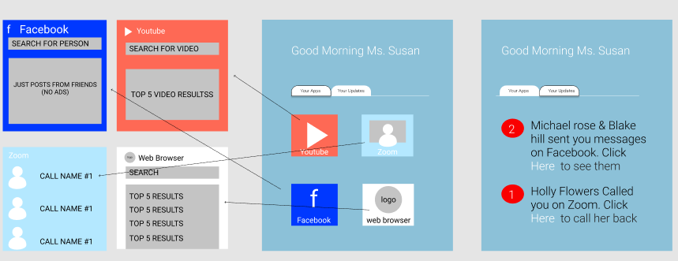

# YOUR PRODUCT/TEAM NAME
> _Note:_ This document is meant to evolve throughout the planning phase of your project.   That is, it makes sense for you commit regularly to this file while working on the project (especially edits/additions/deletions to the _Highlights_ section). Most importantly, it is a reflection of all the planning you work you've done in the first iteration. 
 > **This document will serve as a master plan between your team, your partner and your TA.**

## Product Details
 
#### Q1: What are you planning to build?

 > Short (1 - 2 min' read)
 * Start with a single sentence, high-level description of the product.
 * Be clear - Describe the problem you are solving in simple terms.
 * Be concrete. For example:
    * What are you planning to build? Is it a website, mobile app,
   browser extension, command-line app, etc.?      
    * When describing the problem/need, give concrete examples of common use cases.
    * Assume your the reader knows nothing about the problem domain and provide the necessary context. 
 * Focus on *what* your product does, and avoid discussing *how* you're going to implement it.      
   For example: This is not the time or the place to talk about which programming language and/or framework you are planning to use.
 * **Feel free (and very much encouraged) to include useful diagrams, mock-ups and/or links**.


#### Q2: Who are your target users?

  > Short (1 - 2 min' read max)
 * Be specific (e.g. a 'a third-year university student studying Computer Science' and not 'a student')
 * **Feel free (but not obligated) to use personas.         
   You can create your personas as part of this Markdown file, or add a link to an external site (for example, [Xtensio](https://xtensio.com/user-persona/)).**
   
   Our Application's target users are seniors but can also be used by people whom are less technologically literate. The key functionality of our application is to make mobile phone more approachable and less daunting to unfamiliar users. Especially due to the events of COVID-19, many users have become more dependant on using technology such as the mobile phone for everyday services. This is compounded by the fact that members of the senior community are especially vulnerable in the current global health emergency. Many of the useful technologies such as Facebook and Zoom have complicated interfaces that is incredibly discouraging to these users and can lead to frustration and avoidance. Our application aims to make the experience easier and less intimidating for senior users. Which we hope will help members of the senior community become more accustomed to using some of the fantastic tools we have today. 
  

#### Q3: Why would your users choose your product? What are they using today to solve their problem/need?

> Short (1 - 2 min' read max)
 * We want you to "connect the dots" for us - Why does your product (as described in your answer to Q1) fits the needs of your users (as described in your answer to Q2)?
 * Explain the benefits of your product explicitly & clearly. For example:
    * Save users time (how much?)
    * Allow users to discover new information (which information? And, why couldn't they discover it before?)
    * Provide users with more accurate and/or informative data (what kind of data? Why is it useful to them?)
    * Does this application exist in another form? If so, how does your differ and provide value to the users?
    * How does this align with your partner's organization's values/mission/mandate?

#### Q4: How will you build it?

> Short (1-2 min' read max)
 * What is the technology stack? Specify any and all languages, frameworks, libraries, PaaS products or tools. 
 * How will you deploy the application?
 * Describe the architecture - what are the high level components or patterns you will use? Diagrams are useful here. 
 * Will you be using third party applications or APIs? If so, what are they?
 * What is your testing strategy?

#### Q5: What are the user stories that make up the MVP?

 * At least 5 user stories concerning the main features of the application - note that this can broken down further
 * You must follow proper user story format (as taught in lecture) ```As a <user of the app>, I want to <do something in the app> in order to <accomplish some goal>```
 * If you have a partner, these must be reviewed and accepted by them
 * The user stories should be written in Github and each one must have clear acceptance criteria.
  
User Stories:
1. As an 82 year old man, Thomas wants to be able to simply click a name to have a video call with his grandchildren without having to deal with the confusing settings and small menus of Zoom.
2. As a 66 year old, Ethel wants to be able to watch baking recipes on YouTube just by searching and clicking on a related video without having to deal with so many buttons and recommendations/autoplay and subscriptions from YouTube.
3. At 72, Ming wants to be able to see all the emails and app notifications he gets in one place without having to remember which app does what, and where they are in his app drawer and miss something important.
4. At 78 years old, Geeta wants to see and bookmark results for her web search without the clutter of pages and pages of results, sponsored content and ads, complicated tabs, advanced settings, and bookmark folders.
5. At 68 years old, Greg would like to be able to open up the app, and start messaging his friends and keeping up with his family on Facebook in just a few clicks without the overwhelming number of settings and buttons and tabs on the Facebook app that he can't find on his home screen.
6. At 87 years old, Zorya wants to be able to use the basic functions of her phone like check the weather or call her daughter without having to navigate through different apps and an overwhelming phone UI.

----

## Process Details

#### Q6: What are the roles & responsibilities on the team?

Describe the different roles on the team and the responsibilities associated with each role. 
 * Roles should reflect the structure of your team and be appropriate for your project. Not necessarily one role to one team member.

List each team member and:
 * A description of their role(s) and responsibilities including the components they'll work on and non-software related work
 * 3 technical strengths and weaknesses each (e.g. languages, frameworks, libraries, development methodologies, etc.)
 
 Tiago Ferreira

- I will take on the role of a Fullstack engineer. I will work to integrate some of the Company API's into our application and then build out simple front-end components that utilize those API's to provide our senior uses a simplified and easier to use version of that specific app (E.G. Using the Youtube API to built a simple coomponent that only allows you to search for videos and see the top 10 results and nothing else, and plays the video selected (See Mockup for better context)). 
 
 - ```3 technical strengths```: Multiple internships so I am familar with working in a large team to develop software, familar with working with all kinds of API's using multiple languages (JavaScript, Python, etc.), and familar building out UI'S for apps and websites using languages and frameworks like (HTML, CSS, JS, Bootstrap, React, Etc.). 
 - ```3 technical weaknesses```: Unfamilar with IOS development using tools like Xcode and languages like Swift, unfamiliar with some company API's we might need (E.G. Facebook & Zoom), and no experience building mobile applications in an industry environment so may be unfamiliar with industry standards.
 
Kshitij Shah

  - I will take on the role of a front-end developer. This involves developing user facing components in the applications. Primarily implementing visual elements that users interact with and additionally acting as a translator from user input to functionality on the back-end. This includes responsibilities such as implementing the UI, and making it suitable for different screens/use cases, accepting and validating user inputs when appropriate, mechanism for presenting feedback to users, etc. 
 
  - ```3 technical strengths```: 
    - I have experience working with creating MVP's in small teams with Agile methodology from previous a internship. 
    - I'm very familiar with using Git in the context of a large scale product with many contributors in a way that optimizes for modularity and easy-to-review pull requests. 
    - I have course and internship experience working with languages Python, JavaScript, C, as well as with many frameworks and supporting tools (e.g. React, CSS, HTML, Bootstrap) in a Unix environment.

  - ```3 technical weaknesses```:
    - My mobile experience is limited to that from A1, using React Native. I have 0 experience with native development on iOS/Android and languages/tools/best practices for design.
    - I've never worked directly with API's written by other people, so incorporating API's from existing products (e.g. YouTube, Facebook, ...) that our software will integrate or working with backend's implemented by other team members will be challenging.
    - In previous experiences, I have been in full control of the product/stack; I followed my own style guide/development strategy as opposed to integrating with others.

Ziyao Han

 - I will take on the role of a Quality Assurance Engineer. In this role, I will ensure that our application meets the requirements of the product owner and work to guard the application from bugs, errors, and defects. I will work to create automated tests, integrated tests, and other tools and methods in order to make sure that our application is running as expected. In addition, I will participate in code review sessions and provide meaningful feedback.
 
  - ```3 technical strengths```: 
    - I am familiar working in a group environment to develop an medium-large scale applications through previous experiences. 
    - Through multiple projects and experiences, I have learned and familiarized myself with many of the tools and langauges we will be working on with this project such as Python, Java, React, JS, CSS.
    - I am comfortable performing collaboration-based development through Git and performing tasks such as code reviews, branch management, and pair programming.
    
  - ```3 technical weaknesses```: 
    - I have limited experience working in a mobile development environment and working with tools such as Swift, Android Studio, etc
    - I am unfamiliar with integrating third-party API's from existing products (e.g. YouTube, Facebook, ...) into an application and developing tools such as integrated video players, etc. 
    - This is my first time working to develop a real world application with my previous experiences being in an educational environment.

Nancy Zhao

- I will take on the role of Fullstack Engineer. This involves integrating with APIs, building out the interaction flows given our user stories, and overall working on any needed frontend/backend/database tasks.

- ```3 technical strengths```:
    - I have experience in backend engineering, with various stacks in previous internships, and using languages such as Python, Ruby, C#, Java, and JavaScript.
    - I have experience in frontend engineering, with various stacks in previous internships, having used JavaScript/TypeScript, React, and different UI frameworks such as Semantic UI and Fluent UI.
    - I am familiar with version control with Git and scrum practices with GitHub and Azure DevOps, and comfortable with code reviews, branch management, and pair programming.

- ```3 technical weaknesses```:
    - My mobile development experience is limited, having only done an Android project two years ago and the React Native portion of A1.
    - I'm not as familiar with design sprint and user research practices, having only observed from working with designers and product managers in the past.
    - I'm not familiar with the APIs of the platforms we would be working with; Facebook, YouTube, Zoom, etc.

#### Q7: What operational events will you have as a team?

Describe meetings (and other events) you are planning to have. 
 * When and where? Recurring or ad hoc? In-person or online?
 * What's the purpose of each meeting?
 * Other events could be coding sessions, code reviews, quick weekly sync meeting online, etc.
 * You must have at least 2 meetings with your project partner (if you have one) before D1 is due. Describe them here:
   * What did you discuss during the meetings?
   * What were the outcomes of each meeting?
   * You must provide meeting minutes.
   * You must have a regular meeting schedule established by the second meeting.
   
Q7 response:
* Our team has recurring team meetings every Wednesday starting at 8:00 PM. The meetings are held through Zoom. These meetings are within team members only         (project partner not present). 
* Our team also agrees on having ad hoc team meetings if need be. Everyone's general availability throughout the week has been recorded on WhenToMeet for           easy reference. Ad hoc meetings will be on Zoom and with be coordinated through the team Facebook Messenger group chat. 
* Our meetings are used for the following purposes:
    * Project progress chat: Each team member reports on they have accomplished on the project the past week
    * Group troubleshoot session: Group members discuss any unsolved issues they have encounted the past week and the team attempts to troubleshoots the issues 
    * Work allocation/reallocation: Based on the progress chat and troubleshoot session, if need be, the group allocated/reallocates aspects of the project individual team members
* Our team has weekly meetings with our project partner, Rodrigo, through Zoom every week at 12:00 PM Tuesday. 
* Meeting minutes to all our group meetings (including both sessions with Project Partner and sessions within team members only) can be found here: 
 https://docs.google.com/document/d/1qTB5BxwvksWi4nVMG1icAFfm5Gksd37m92mA0ErPzJA/edit?fbclid=IwAR24smdFHlDZAO9mQkIMqF68BwrtHEBkzq4ookYeBCVQn08uXYOx9G3Axyk
 
#### Q8: What artifacts will you use to self-organize?

List/describe the artifacts you will produce in order to organize your team.       

 * Artifacts can be To-Do lists, Task boards, schedule(s), meeting minutes, etc.
 * We want to understand:
   * How do you keep track of what needs to get done?
   * How do you prioritize tasks?
   * How do tasks get assigned to team members?
   * How do you determine the status of work from inception to completion?

#### Q9: What are the rules regarding how your team works?

Describe your team's working culture.

**Communications:**
 * What is the expected frequency? What methods/channels are appropriate? 
 * If you have a partner project, what is your process (in detail) for communicating with your partner?
 
**Meetings:**
 * How are people held accountable for attending meetings, completing action items? Is there a moderator or process?
 
**Conflict Resolution:**
 * List at least three team scenarios/conflicts you discussed in lecture and how you decided you will resolve them. Indecisions? Non-responsive team members? Any other scenarios you can think of?


----
### Highlights

Specify 3 - 5 key decisions and/or insights that came up during your meetings
and/or collaborative process.

 * Short (5 min' read max)
 * Decisions can be related to the product and/or the team process.
    * Mention which alternatives you were considering.
    * Present the arguments for each alternative.
    * Explain why the option you decided on makes the most sense for your team/product/users.
 * Essentially, we want to understand how (and why) you ended up with your current product and process plan.
 * This section is useful for important information regarding your decision making process that may not necessarily fit in other sections. 
 
 ---
 ## Software Mockup
 
 
